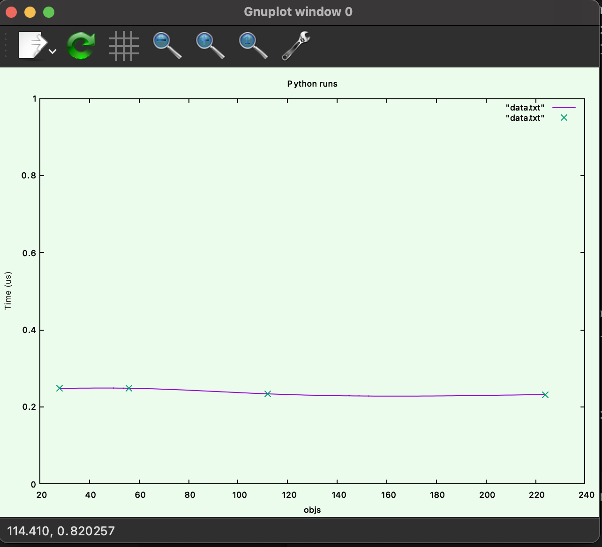
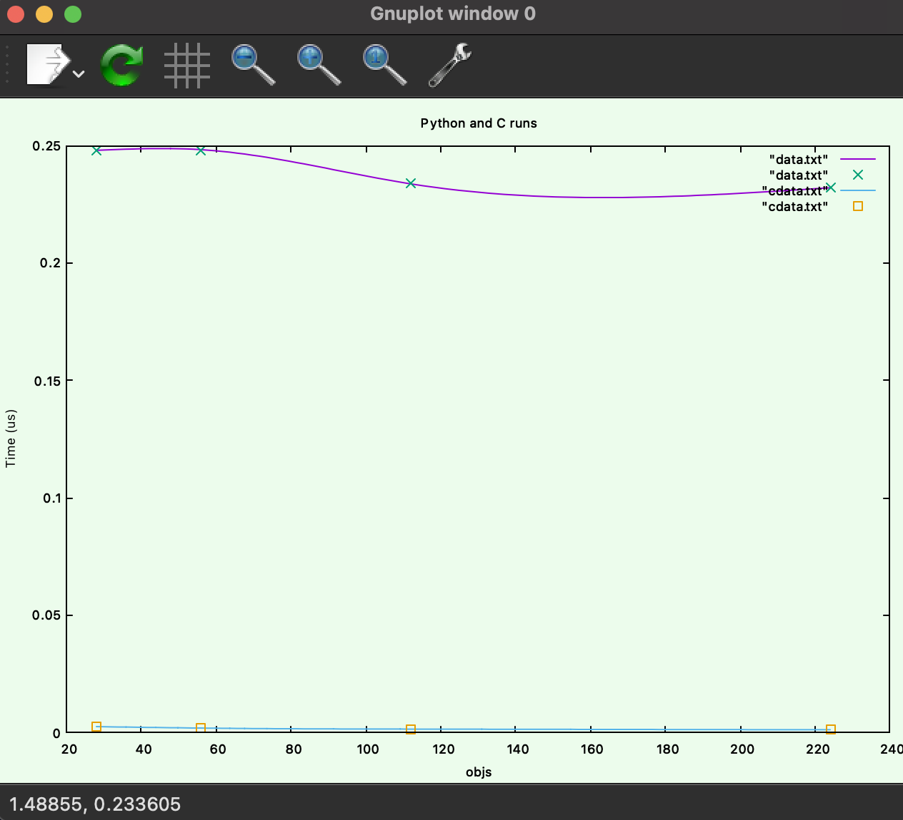

<!-- '''
    set xlabel "objs"\
    set ylabel "Time (us)"\
    set title "Python update_locations\
    set yrange [0:1]\
    f(x) = m*x + b\
    fit f(x) 'data.txt' using 1:2 via m,b\
    plot "data.txt" smooth csplines, "data.txt" with points\
''' -->

# A
    
I decided to run the tests with as many iterations as possible, so that any outliers would be absorbed into the average. I ran the program on  28 objects with 200000 iterations, 56 objects with 100000 iterations, 112 objects  with 50000 iterations, and 224 objects with 25000 iterations. I chose these numbers by testing several iteration sizes until I found one that took about 2 seconds to run with 224 objects, then scaled that iteration number up as I decreaed the number of objects. I also ran each test 10 times and took the average of the times, allowing for variation in the runs. This process can be seen by running

    sh test.sh

Which will output the data into `data.txt`. I then plotted that data, as shown below, using gnuplot
    #objs   time(us)
    28      0.247929	 
    56      0.2482	 
    112 	0.233636	 
    224	    0.231991	 

# B

I interpreted 'as close to python as possible' meant to use doubles for everything. I did that, as can be seen in `update_locations.c`. Note I did not copy the memory part of the python code because there is no easy way to emulate that in C. The process I used was exactly the same as above. It can be seen by running

    sh testc.sh

Which will output the data into `cdata.txt`. Here is an example run
    #objs   time(us)
    28	    0.0025435	 
    56	    0.001918	 
    112	    0.0014841	 
    224	    0.00118837	 

And here is the two sets of data plotted together.

# C

Here are the outputs for the different types using the shell script discussed in part B. Times for a type of double can be found above.

Float
    #objs   time(us)
    28	    0.00237	 
    56	    0.0011784	 
    112	    0.0005936	 
    224	    0.0002942	 

int8_t
    28	0.0016189	 
    56	0.000784	 
    112	0.0003826	 
    224	0.0002045	

int16_t
    #objs   time(us)
    28	0.002205	 
    56	0.0009167	 
    112	0.0004074	 
    224	0.0002637	 

int32_t
    #objs   time(us)
    28	    0.0015994	 
    56	    0.0009605	 
    112 	0.0004517	 
    224	    0.0002336	 

int64_t
    #objs   time(us)
    28	    0.0015402	 
    56	    0.0007412	 
    112	    0.0004559	 
    224	    0.0002874	
